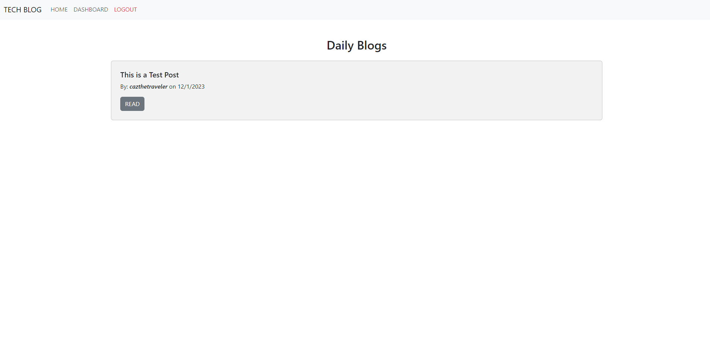

# Tech Blog

## Description

This project demonstrates a full stack knowledge to create a blog site. This site allows you to view blog posts made by other users and make posts of your own.
As of now, you can only create an account and login, and make blog posts. Adding comments or being able to edit or delete your blog posts are not functional.

## Usage

This project can be run on a local server.

When you first arrive to the homepage, you are presented with blog posts made and you are able to read them. You also have the choice to view your dashboard, unless you're not logged in, then it will redirect you to the login page, which also has a register side. Once you register/login, then you'll be able to make posts of your own in the dashboard. You can also view other posts that other users have made. If you're logged in, then the option to add a comment will be available to you.

## Deployed Link

https://salty-lake-64153-375f463ac159.herokuapp.com/
